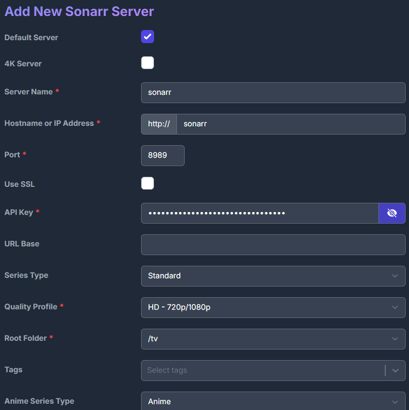

# [EN] Important: Server Launch, Port Forwarding and Mode Selection

If you're running services on a server (not locally), make sure to forward the necessary ports through firewall/VSCode/ssh:
- 7878 (Radarr)
- 8989 (Sonarr)
- 9696 (Prowlarr)
- 5080 (qBittorrent)
- 8096 (Jellyfin)
- 5055 (Jellyseerr)
- 3000 (Recommendarr)
- 8191 (Flaresolverr)

## Two Launch Options
- **Normal**: `docker-compose.yml` — all traffic goes directly
- **VPN**: `docker-compose-vpn.yml` — all torrent traffic goes through VPN (Wireguard)

### Why VPN is Better?
- Many torrent trackers and indexes (especially through Prowlarr) ban/restrict server IPs, often due to Cloudflare or other anti-abuse systems
- VPN helps bypass blocks, hide your server IP, and avoid DMCA/abuse notices
- Without VPN, some indexes may not work at all

---

### Clone Project and Create Empty `.env`
```bash
git clone https://github.com/brintadis/jellyfin_server.git
```
```bash
touch .env
```


### Fill `.env` according to example:

```.env
MEDIA_PATH=/home/makar/jellyfin_server/media
TZ=Europe/Moscow

# VPN profile settings
VPN_SERVICE_PROVIDER=custom
VPN_TYPE=wireguard
WIREGUARD_ENDPOINT_IP=WIREGUARD_ENDPOINT_IP
WIREGUARD_ENDPOINT_PORT=WIREGUARD_ENDPOINT_PORT
WIREGUARD_PUBLIC_KEY=WIREGUARD_PUBLIC_KEY
WIREGUARD_PRIVATE_KEY=WIREGUARD_PRIVATE_KEY
WIREGUARD_ADDRESSES="WIREGUARD_ADDRESSES"

SONARR_STATIC_CONTAINER_IP=172.20.0.12
RADARR_STATIC_CONTAINER_IP=172.20.0.13
```

### Create Network for Jellyfin Services
```bash
docker network create --subnet 172.20.0.0/16 mynetwork
```

### Create Media Folder and Set Permissions
```bash
mkdir /home/makar/jellyfin_server/media
sudo chown 1000:1000 /home/makar/jellyfin_server/media
```

### Launch Without VPN
```bash
docker compose -f docker-compose.yml up -d
```

### Launch With VPN
```bash
docker compose -f docker-compose-vpn.yml up -d
```

## [qBittorrent](http://localhost:5080)

To manage qBittorrent, access the WEB interface: http://localhost:5080

Temporary password can be obtained from container logs `docker logs qbittorrent`

logs example
```bash
******** Information ********
To control qBittorrent, access the WebUI at: http://localhost:5080
The WebUI administrator username is: admin
The WebUI administrator password was not set. A temporary password is provided for this session: 8hpncXsqy
You should set your own password in program preferences.
Connection to localhost (::1) 5080 port [tcp/*] succeeded!
[ls.io-init] done.
```


Change password:
Tools --> Options --> WebUI --> Change password


### qBittorrent Downloads
On the `Downloads` tab, adjust Saving Management settings


### qBittorrent Category
For sonarr and radarr, we'll have separate download paths.
Create necessary subfolders in qbittorrent container
```bash
docker exec -it qbittorrent bash
```

```bash
mkdir /downloads/radarr /downloads/sonarr
```

```bash
chown 1000:1000 /downloads/radarr /downloads/sonarr
```

Return to WEBUI and add new categories


#### qBittorrent Category sonarr
```
Category:
sonarr

Save path:
/downloads/sonarr
```

#### qBittorrent Category radarr
```
Category:
radarr

Save path:
/downloads/radarr
```

## [Radarr](http://localhost:7878)

```bash
docker exec -it radarr bash
```

```bash
chown 1000:1000 /movies
```

Open WEBUI, register.
`Authentication Method`, `Username`, `Password`(write it down, we will need this for other services configuration)


### [Radarr Settings Media Management](http://localhost:7878/settings/mediamanagement)

Change Media management settings, add our movies folder


### [Radarr Settings Quality](http://localhost:7878/settings/quality)

Settings for this page should be taken from [this](https://trash-guides.info/Radarr/Radarr-Quality-Settings-File-Size/) guide

### [Radarr Download Clients](http://localhost:7878/settings/downloadclients)

<details>
<summary>VPN option</summary>

```VPN
http://qbittorrent:5080 -> http://vpn:5080
```
</details>


### [Radarr General](http://localhost:7878/settings/general)

On this page, we can see the [API key](http://localhost:7878/settings/general#:~:text=Password%20Confirmation-,API,-Key) for Radarr, which we'll need later

Get Radarr API Key [here](http://localhost:7878/settings/general#:~:text=Password%20Confirmation-,API,-Key)

## Sonarr
WEBUI [Sonarr](http://localhost:8989)

```bash
docker exec -it sonarr bash
```

```bash
chown 1000:1000 /tv /anime
```

Open WEBUI, register.
`Authentication Method`, `Username`, `Password`(write it down, we will need this for other services configuration)

### [Sonarr Settings Media Management](http://localhost:8989/settings/mediamanagement)

Change Media management settings, add our movies folder:
1)Episode Naming
1.1)Enable `Rename Episodes'
2)File Management
2.1)Enable `Unmonitor Deleted Episodes`

Scroll down the page to `Root Folders` and add necessary folders:


Save changes at the top of the page `Save Changes`

### [Sonarr Settings Quality](http://localhost:8989/settings/quality)

Settings for this page should be taken from [this](https://trash-guides.info/Radarr/Radarr-Quality-Settings-File-Size/) guide

### [Sonarr Download Clients](http://localhost:8989/settings/downloadclients)

Connect Sonarr to qBittorrent,
`if VPN option was selected, specify vpn in host`

### [Sonarr General](http://localhost:8989/settings/general)

On this page, we can see the [API key](http://localhost:8989/settings/general#:~:text=Password%20Confirmation-,API,-Key) for Sonarr, which we'll need later

Get Sonarr API Key [here](http://localhost:8989/settings/general#:~:text=Password%20Confirmation-,API,-Key)

## [Prowlarr](http://localhost:9696)

<details>
<summary>VPN option</summary>

```VPN
WEBUI `http://vpn:9696`
```
</details>

Complete registration similar to radarr, sonarr

<details>
<summary>VPN option</summary>

### [Prowlar Flaresolver](http://localhost:9696/settings/indexers)
Connect to flaresolverr

</details>

### Prowlar Radarr
Connect to [Radarr](http://localhost:9696/settings/applications)

<details>
<summary>VPN option</summary>

```VPN
http://prowlarr:9696 -> http://vpn:9696
```
</details>


Get Radarr API Key [here](http://localhost:7878/settings/general#:~:text=Password%20Confirmation-,API,-Key)

<details>
<summary>VPN option</summary>

```VPN
Replace Radarr server IP with the one specified in `.env`
http://radarr:7878 -> http://RADARR_STATIC_CONTAINER_IP:7878
```
</details>


### Prowlar Sonarr
Connect to [Sonarr](http://localhost:9696/settings/applications)

<details>
<summary>VPN option</summary>

```VPN
http://prowlarr:9696 -> http://vpn:9696
```
</details>


<details>
<summary>VPN option</summary>

```VPN
Replace Sonarr server IP with the one specified in `.env`
http://sonarr:8989 -> http://SONARR_STATIC_CONTAINER_IP:8989
```
</details>

Get Sonarr API Key [here](http://localhost:8989/settings/general#:~:text=Password%20Confirmation-,API,-Key)


### [Prowlar Indexers](http://localhost:9696/)
Add trackers


Filter by language and add needed trackers


Specify BASE URL from dropdown list, username, password, and enable
`Strip Russian letters` and
`Use Magnet Links`

After adding all needed trackers, sync with Radarr, Sonarr


and verify that they appear in [Radarr](http://localhost:7878/settings/indexers) and [Sonarr](http://localhost:8989/settings/indexers)

## [Jellyfin](http://localhost:8096/web)

```bash
docker exec -it jellyfin bash
```

```bash
chown 1000:1000 /data/movies data/tvshows data/anime
```
Select UI language

Create Jellyfin account

Add needed media folders


### Jellyfin Plugins
Add Subtitles downloader, metadata, skinmanager etc.

## [Jellyseerr](http://localhost:5055/)


Specify jellyfin:8096 and authorize in our account

Click Sync Libraries and activate found folders.


Connect to Radarr API Key get [here](http://localhost:7878/settings/general#:~:text=Password%20Confirmation-,API,-Key)


Connect to Sonarr API Key get [here](http://localhost:8989/settings/general#:~:text=Password%20Confirmation-,API,-Key)




# FAQ
Q: See error `network mynetwork declared as external, but could not be found`
A: Forgot to create `mynetwork`

Q: When creating network get error `Error response from daemon: invalid pool request: Pool overlaps with other one on this address space`
A: This means a network with this address already exists on your server. Try changing IP
```docker network create --subnet 172.20.0.0/16 mynetwork```
to
```docker network create --subnet 172.21.0.0/16 mynetwork```


<details>
<summary>RU README</summary>

# Важно: запуск с сервера, проброс портов и выбор режима

Если ты запускаешь сервисы на сервере (не на локалке), обязательно пробрось нужные порты через firewall/VSCode/ssh:
- 7878 (Radarr)
- 8989 (Sonarr)
- 9696 (Prowlarr)
- 5080 (qBittorrent)
- 8096 (Jellyfin)
- 5055 (Jellyseerr)
- 3000 (Recommendarr)
- 8191 (Flaresolverr)

## Два режима запуска
- **Обычный**: `docker-compose.yml` — весь трафик идёт напрямую
- **VPN**: `docker-compose-vpn.yml` — весь торрент-трафик идёт через VPN (Wireguard)

### Почему лучше через VPN?
- Многие торрент-трекеры и индексы (особенно через Prowlarr) банят/ограничивают IP серверов, часто из-за Cloudflare или других антиабуз систем
- VPN позволяет обойти блокировки, не светить свой серверный IP и не ловить DMCA/abuse
- Без VPN часть индексов может не работать вообще

---

### Клонируем проект и создаем пустой `.env`
```bash
git clone https://github.com/brintadis/jellyfin_server.git
```
```bash
touch .env
```

### Заполняем `.env`по примеру:

```.env
MEDIA_PATH=/home/makar/jellyfin_server/media
TZ=Europe/Moscow

# VPN profile settings
VPN_SERVICE_PROVIDER=custom
VPN_TYPE=wireguard
WIREGUARD_ENDPOINT_IP=WIREGUARD_ENDPOINT_IP
WIREGUARD_ENDPOINT_PORT=WIREGUARD_ENDPOINT_PORT
WIREGUARD_PUBLIC_KEY=WIREGUARD_PUBLIC_KEY
WIREGUARD_PRIVATE_KEY=WIREGUARD_PRIVATE_KEY
WIREGUARD_ADDRESSES="WIREGUARD_ADDRESSES"

SONARR_STATIC_CONTAINER_IP=172.20.0.12
RADARR_STATIC_CONTAINER_IP=172.20.0.13
```
### Создаем сеть под jellyfin сервисы
```bash
docker network create --subnet 172.20.0.0/16 mynetwork
```
### Создаем папку с media, правим доступы
```bash
mkdir /home/makar/jellyfin_server/media
sudo chown 1000:1000 /home/makar/jellyfin_server/media
```
### Запуск без VPN

```bash
docker compose -f docker-compose.yml up -d
```
### Запуск с VPN

```bash
docker compose -f docker-compose-vpn.yml up -d
```

## [qBittorrent](http://localhost:5080)

Для управления qBittorrent заходи в WEB-интерфейс: http://localhost:5080

Временный пароль можно получить из логов контейнера `docker logs qbittorrent`

logs example
```bash
******** Information ********
To control qBittorrent, access the WebUI at: http://localhost:5080
The WebUI administrator username is: admin
The WebUI administrator password was not set. A temporary password is provided for this session: 8hpncXsqy
You should set your own password in program preferences.
Connection to localhost (::1) 5080 port [tcp/*] succeeded!
[ls.io-init] done.
```


Заменяем пароль:
Tools --> Options --> WebUI --> Change password


### qBittorrent Downloads
На вкладке `Downloads` правим настройки Saving Management


### qBittorrent Category
Для sonarr и radarr у нас будут отдельный пути загрузки.
Создаем нужные подпапки в контейнере qbitorrent
```bash
docker exec -it qbittorrent bash
```

```bash
mkdir /downloads/radarr /downloads/sonarr
```

```bash
chown 1000:1000 /downloads/radarr /downloads/sonarr
```

Возвращаеся в WEBUI и добавляем новые категории


#### qBittorrent Category sonarr
```
Category:
sonarr

Save path:
/downloads/sonarr
```

#### qBittorrent Category radarr
```
Category:
radarr

Save path:
/downloads/radarr
```


## [Radarr](http://localhost:7878)

```bash
docker exec -it radarr bash
```

```bash
chown 1000:1000 /movies
```

Открываем WEBUI, регистрируемся.
`Authentication Method`, `Username`, `Password`(write it down, we will be need this for othre services configuration)


### [Radarr Settings Media Management](http://localhost:7878/settings/mediamanagement)

Меняем настройки Media management, добавляем нашу папку с movies


### [Radarr Settings Quality](http://localhost:7878/settings/quality)

Настройки для этой страницы брать из [этого](https://trash-guides.info/Radarr/Radarr-Quality-Settings-File-Size/) гайда

### [Radarr Download Clients](http://localhost:7878/settings/downloadclients)

<details>
<summary>VPN вариант</summary>

```VPN
http://qbittorrent:5080 -> http://vpn:5080
```
</details>


### [Radarr General](http://localhost:7878/settings/general)

На этой странице видим [API ключ](http://localhost:7878/settings/general#:~:text=Password%20Confirmation-,API,-Key) к Radarr, он нам пригодиться позже

Radarr API Key берём [здесь](http://localhost:7878/settings/general#:~:text=Password%20Confirmation-,API,-Key)


## Sonarr
WEBUI [Sonarr](http://localhost:8989)

```bash
docker exec -it sonarr bash
```

```bash
chown 1000:1000 /tv /anime
```

Открываем WEBUI, регистрируемся.
`Authentication Method`, `Username`, `Password`(write it down, we will be need this for othre services configuration)

### [Sonarr Settings Media Management](http://localhost:8989/settings/mediamanagement)

Меняем настройки Media management, добавляем нашу папку с movies:
1)Episode Naming
1.1)Включаем `Rename Episodes'
2)File Management
2.1)Включаем `Unmonitor Deleted Episodes`


Листаем вниз стрнаицы до `Root Folders` здесь добавляем нужные папки:


Вверху страницы сохраняем изменения `Save Changes`

### [Sonarr Settings Quality](http://localhost:8989/settings/quality)


Настройки для этой страницы брать из [этого](https://trash-guides.info/Radarr/Radarr-Quality-Settings-File-Size/) гайда

### [Sonarr Download Clients](http://localhost:8989/settings/downloadclients)

Подключаем Sonarr к qBittorrent, 
`если был выбран VPN вариант, то в host указываем vpn`


### [Sonarr General](http://localhost:8989/settings/general)

На этой странице видим [API ключ](http://localhost:8989/settings/general#:~:text=Password%20Confirmation-,API,-Key) к Sonarr, он нам пригодится позже

Sonarr API Key берём [здесь](http://localhost:8989/settings/general#:~:text=Password%20Confirmation-,API,-Key)


## [Prowlarr](http://localhost:9696)

<details>
<summary>VPN вариант</summary>

```VPN
WEBUI `http://vpn:9696`
```
</details>

Проходим регистрацию, аналогичную radarr, sonarr

<details>
<summary>VPN вариант</summary>

### [Prowlar Flaresolver](http://localhost:9696/settings/indexers)
Подключаемся к flaresolverr

</details>


### Prowlar Radarr
Подключаемся к [Radarr](http://localhost:9696/settings/applications)

<details>
<summary>VPN вариант</summary>

```VPN
http://prowlarr:9696 -> http://vpn:9696
```
</details>


Radarr API Key берем [здесь](http://localhost:7878/settings/general#:~:text=Password%20Confirmation-,API,-Key)

<details>
<summary>VPN вариант</summary>

```VPN
Заменяем IP Radarr сервера на указанный в ` .env`
http://radarr:7878 -> http://RADARR_STATIC_CONTAINER_IP:7878
```
</details>


### Prowlar Sonarr
Подключаемся к [Sonarr](http://localhost:9696/settings/applications)


<details>
<summary>VPN вариант</summary>

```VPN
http://prowlarr:9696 -> http://vpn:9696
```
</details>


<details>
<summary>VPN вариант</summary>

```VPN
Заменяем IP Sonarr сервера на указанный в `.env`
http://sonarr:8989 -> http://SONARR_STATIC_CONTAINER_IP:8989
```
</details>

Sonarr API Key берем [здесь](http://localhost:8989/settings/general#:~:text=Password%20Confirmation-,API,-Key)


### [Prowlar Indexers](http://localhost:9696/)
Добавляем трекеры


Фильтрация по языку и добавляем нужные трекеры


Указываем BASE URL из выпадающего списка, username, password, а также включаем
`Strip Russian letters` и
`Use Magnet Links`

После добавления всех нужных трекеров делаем синхронизацию с Radarr, Sonarr


и проверяем что в [Radarr](http://localhost:7878/settings/indexers) и [Sonarr](http://localhost:8989/settings/indexers) появились нужные

## [Jellyfin](http://localhost:8096/web)

```bash
docker exec -it jellyfin bash
```

```bash
chown 1000:1000 /data/movies data/tvshows data/anime
```
Выбираем язык UI

Создаем учетку в Jellyfin

Добавляем нужные папки с медиа


### Jellyfin Plugins
Добавить Subtitles downloader, metadata, skinmanager и тд


## [Jellyseerr](http://localhost:5055/)


Указываем jellyfin:8096 и авторизуемся в наш аккаунт

Нажимаем Sync Libraries и активируем найденные папки.


Подключаемся к Radarr API Key берем [здесь](http://localhost:7878/settings/general#:~:text=Password%20Confirmation-,API,-Key)


Подключаемся к Sonarr API Key берем [здесь](http://localhost:8989/settings/general#:~:text=Password%20Confirmation-,API,-Key)


# FAQ
Q: Вижу ошибку`network mynetwork declared as external, but could not be found`
A: Забыли создать сеть `mynetwork`

Q: При создании сети получаю ошибку `Error response from daemon: invalid pool request: Pool overlaps with other one on this address space`
A: Значит сеть с таким адресом уже существует на вашем сервере. Попробуйте изменить IP
```docker network create --subnet 172.20.0.0/16 mynetwork```
на 
```docker network create --subnet 172.21.0.0/16 mynetwork```

</details>

