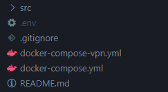

### Клонируем проект и создаем пустой `.env`
```bash
git clone https://github.com/brintadis/jellyfin_server.git
```
```bash
touch .env
```

### Заполняем `.env`по примеру:

```.env
MEDIA_PATH=/home/makar/jellyfin_server/media
TZ=Europe/Moscow

# VPN profile settings
VPN_SERVICE_PROVIDER=custom
VPN_TYPE=wireguard
WIREGUARD_ENDPOINT_IP=WIREGUARD_ENDPOINT_IP
WIREGUARD_ENDPOINT_PORT=WIREGUARD_ENDPOINT_PORT
WIREGUARD_PUBLIC_KEY=WIREGUARD_PUBLIC_KEY
WIREGUARD_PRIVATE_KEY=WIREGUARD_PRIVATE_KEY
WIREGUARD_ADDRESSES="WIREGUARD_ADDRESSES"

SONARR_STATIC_CONTAINER_IP=172.20.0.12
RADARR_STATIC_CONTAINER_IP=172.20.0.13
```
### Создаем сеть под jellyfin сервисы
```bash
docker network create --subnet 172.20.0.0/16 mynetwork
```
### Создаем папку с media, правим доступы
```bash
mkdir /home/makar/jellyfin_server/media
sudo chown 1000:1000 /home/makar/jellyfin_server/media
```
### Запуск без VPN

```bash
docker compose -f docker-compose.yml up -d
```
### Запуск с VPN

```bash
docker compose -f docker-compose-vpn.yml up -d
```

## qBittorrent
`http://localhost:5080`

Default username is admin. Temporary password can be collected from container log `docker logs qbittorrent`

logs example
```bash
******** Information ********
To control qBittorrent, access the WebUI at: http://localhost:5080
The WebUI administrator username is: admin
The WebUI administrator password was not set. A temporary password is provided for this session: 8hpncXsqy
You should set your own password in program preferences.
Connection to localhost (::1) 5080 port [tcp/*] succeeded!
[ls.io-init] done.
```


Go to Tools --> Options --> WebUI --> Change password


### qBittorrent Downloads
На вкладке `Downloads` правим настройки Saving Management


### qBittorrent Category
Для sonarr и radarr у нас будут отдельный пути загрузки.
Создаем нужные подпапки в контейнере qbitorrent
```bash
docker exec -it qbittorrent bash
```

```bash
mkdir /downloads/radarr /downloads/sonarr
```

```bash
chown 1000:1000 /downloads/radarr /downloads/sonarr
```

`http://localhost:5080`

Возвращаеся в браузер и добавляем новые категории


#### qBittorrent Category sonarr
```
Category:
sonarr

Save path:
/downloads/sonarr
```

#### qBittorrent Category radarr
```
Category:
radarr

Save path:
/downloads/radarr
```


## Radarr
WEBUI `http://localhost:7878`

```bash
docker exec -it radarr bash
```

```bash
chown 1000:1000 /movies
```

Открываем WEBUI, регистрируемся.
`Authentication Method`, `Username`, `Password`(write it down, we will be need this for othre services configuration)


### Radarr Media Management
`http://localhost:7878/settings/mediamanagement`

Меняем настройки Media management, добавляем нашу папку с movies


### Radarr Quality
`http://localhost:7878/settings/quality`

Настройки для этой страницы брать из [этого](https://trash-guides.info/Radarr/Radarr-Quality-Settings-File-Size/) гайда

### Radarr Download Clients
`http://localhost:7878/settings/downloadclients`

Подключаем Radarr к qBittorrent,
`если был выбран VPN вариант, то в host указываем vpn`


### Radarr General
`http://localhost:7878/settings/general`

На этой странице видим `API ключ` к Radarr, он нам пригодиться позже


## Sonarr
WEBUI `http://localhost:8989`

```bash
docker exec -it sonarr bash
```

```bash
chown 1000:1000 /tv /anime
```

Открываем WEBUI, регистрируемся.
`Authentication Method`, `Username`, `Password`(write it down, we will be need this for othre services configuration)

### Sonarr Media Management
`http://localhost:8989/settings/mediamanagement`

Меняем настройки Media management, добавляем нашу папку с movies:
1)Episode Naming
1.1)Включаем `Rename Episodes'
2)File Management
2.1)Включаем `Unmonitor Deleted Episodes`


Листаем вниз стрнаицы до `Root Folders` здесь добавляем нужные папки:


Вверху страницы сохраняем изменения `Save Changes`

### Sonarr Quality
`http://localhost:8989/settings/quality`

Настройки для этой страницы брать из [этого](https://trash-guides.info/Radarr/Radarr-Quality-Settings-File-Size/) гайда

### Sonarr Download Clients
`http://localhost:8989/settings/downloadclients`

Подключаем Sonarr к qBittorrent, 
`если был выбран VPN вариант, то в host указываем vpn`


### Radarr General
`http://localhost:7878/settings/general`

На этой странице видим `API ключ` к Sonarr, он нам пригодиться позже


## Sonarr
WEBUI `http://localhost:9696`

Проходим регистрацию, аналогичную radarr, sonarr


# FAQ
Q: Вижу ошибку`network mynetwork declared as external, but could not be found`
A: Забыли создать сеть `mynetwork`

Q: При создании сети получаю ошибку `Error response from daemon: invalid pool request: Pool overlaps with other one on this address space`
A: Значит сеть с таким адресом уже существует на вашем сервере. Попробуйте изменить 
```
docker network create --subnet 172.20.0.0/16 mynetwork
```
на 
```
docker network create --subnet 172.21.0.0/16 mynetwork
```

